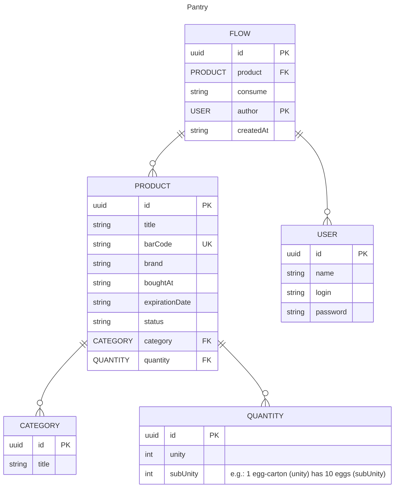

# Despensa (Backend)

Sistema desenvolvido para gestão de uma despensa.

- Desenvolvido em Java 21

Os pontos principais são: 

- cadastrar e acompanhar consumo de produtos de uma despensa;
- receber alertas quando algum produto está próximo da data de validade;
- receber alertas quando algum produto está faltante;

### ERD

